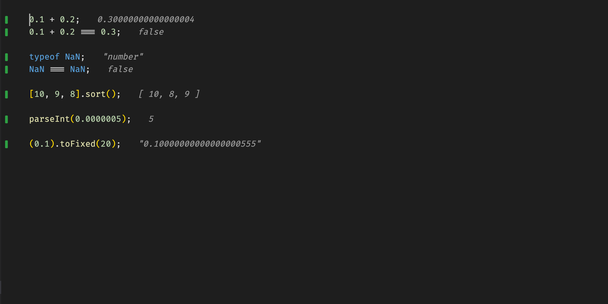

# Quoll

A free, open-source live scratchpad for VS Code — an alternative to [Quokka.js](https://quokkajs.com).

Quoll runs your JavaScript/TypeScript as you type and shows what your code actually does, right in the editor:

- **Inline values** — expression results and variable values appear next to the code that produced them
- **Value peek** — hover an expression to see what it evaluated to, and jump from there into the value explorer
- **Live code coverage** — gutter indicators show which lines ran, didn't run, or partially ran
- **Inline runtime errors** — exceptions and unhandled rejections surface on the line that threw them
- **Console output** — `console.log` results render inline at the call site
- **Live comments** — mark a line with `//?` to single it out, or `//?.` to time it; `quoll.values: "comments"` shows only those
- **Reveal on demand** — in that quiet mode, selecting an expression or setting a breakpoint reveals just that value
- **Browser runtime** — `quoll.runtime: "browser"` gives your scratchpad a jsdom `document` (needs `jsdom` in the project's `node_modules`)
- **Time machine** — step back through a finished run and watch the editor re-render as it stood at each captured value
- **Value explorer** — a tree of the run's captured values, expanded lazily, with copy-to-clipboard
- **Project imports** — import your own files; editing one re-runs the scratchpad
- **TypeScript out of the box** — no build step or config needed
- **Sandboxed execution** — code runs in a permission-locked Deno process: no network, no writes, and reads scoped to your project



Checkout some [more examples](./examples/EXAMPLES.md).

## Status

Quoll is in early, active development and is **not on the marketplace yet** — you run it from source (below).

Everything in the list above works today, for single-file scratchpads — except the browser runtime, which needs a project to resolve jsdom from. The roadmap (see [`quoll-spec.md`](quoll-spec.md), whose "Where the build actually is" section tracks what's done) targets full feature parity with Quokka.js: the interactive timeline and value graphs, CPU profiling, and more.

## How it works

- A **Rust core** (built on [Oxc](https://oxc.rs)) parses, type-strips, and instruments your code in a single pass, producing one source map — so values and coverage always land on the right line.
- A **Deno runner** executes the instrumented code in a sandbox and streams values, coverage, and errors back over a simple NDJSON protocol.
- The **VS Code extension** debounces your keystrokes, re-runs on change, and renders results as editor decorations.

## Getting started (from source)

Quoll isn't on the marketplace yet — you run it as a development extension.

**Prerequisites:** Node.js with [pnpm](https://pnpm.io), [rustup](https://rustup.rs), and [Deno](https://deno.com) 2.x (a [mise](https://mise.jdx.dev) pin is included). The Rust version is pinned in `rust-toolchain.toml`, so rustup installs and uses the right one for you — no `rustup update` needed.

```sh
pnpm install
pnpm run build:core   # builds the native instrumentation core
pnpm run build
```

Then open the repo in VS Code, press **F5** to launch the extension development host, open a `.ts` or `.js` file, and run **Quoll: Start** from the command palette. If Deno isn't on your PATH, point `quoll.denoPath` at the binary in your settings.

To run the test suite (the golden-eval harness):

```sh
pnpm run eval
```

## Commands

| Command | What it does |
| --- | --- |
| `Quoll: Start on Current File` | Run the active file and keep it live as you type. |
| `Quoll: Stop Session` | Stop running and clear the decorations. |
| `Quoll: Step Back (Time Machine)` / `Step Forward` | Move through the run's captured values. While stepping: `alt+left` / `alt+right`. The coverage gutter doesn't move — it's a fact about the whole run, not about one moment in it. |
| `Quoll: Resume Live` | Leave the Time Machine (`escape` in the editor), or click the status bar item. |

## Settings

| Setting | Default | What it does |
| --- | --- | --- |
| `quoll.values` | `all` | `all` shows every expression's value inline; `comments` is a quiet mode showing only lines you opt into — a `//?` comment, the current selection, or a breakpoint. |
| `quoll.runtime` | `node` | `browser` installs a jsdom window's globals (`document`, `Element`, `localStorage`, …) before your code runs. Needs `jsdom` in the project's `node_modules` (`npm i -D jsdom`), so it doesn't apply to a bare scratch buffer. |
| `quoll.debounceMs` | `300` | How long after your last keystroke the file re-runs. |
| `quoll.runTimeoutMs` | `10000` | Ceiling on how long a run waits for outstanding timers and promises. Quoll stays alive while they're pending, so a slow `setTimeout` still reports its value; this is what stops a `setInterval` running forever. |
| `quoll.denoPath` | `deno` | Path to the Deno binary used for the sandbox. Auto-detected on first start. |

`quoll.denoPath` and `quoll.runtime` are **machine-scoped**: they're settable in
your own settings only, never by a workspace's `.vscode/settings.json`. Both
choose how much the sandbox is allowed to do, so a repo you cloned to read
shouldn't get to decide them.

## Contributing

Contributions are welcome — bug reports, feature requests, and PRs alike. A few pointers:

- [`quoll-spec.md`](quoll-spec.md) is the source of truth for architecture and the phased roadmap.
- The interfaces in `protocol/` are frozen contracts between the extension, runner, and instrumentation core — changes there need discussion first (open an issue).
- New behavior in the instrument → run → render pipeline should come with a golden-eval case in `eval/cases/`.

If you're unsure where to start, open an issue and ask.

## License

[MIT](LICENSE)
